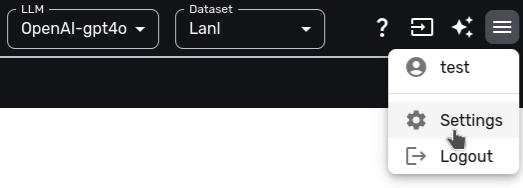
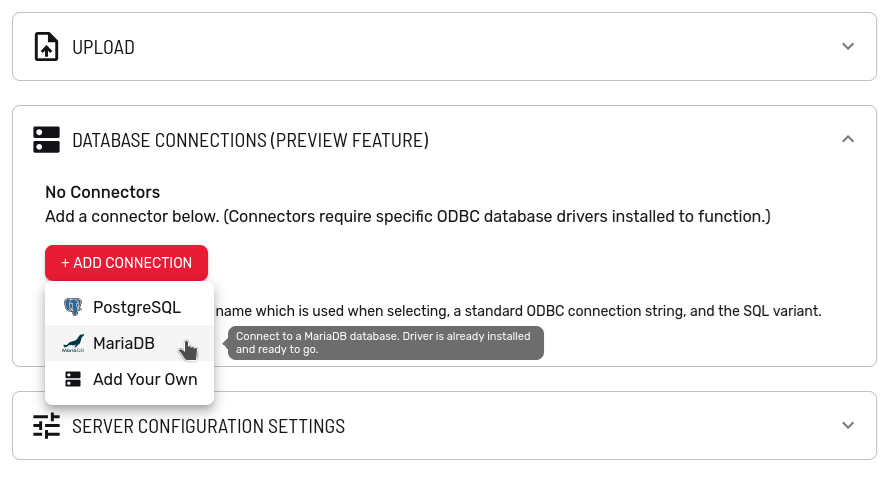
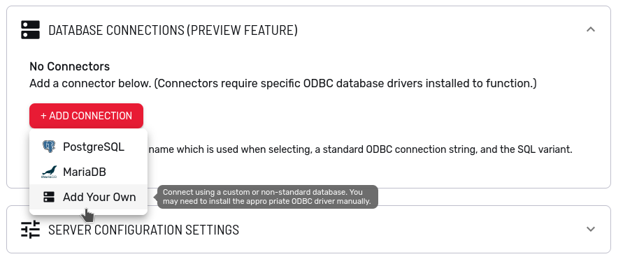
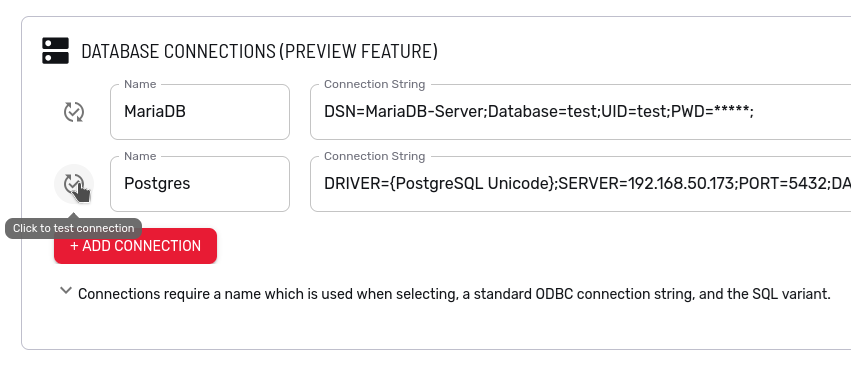

# ODBC Configuration for Rocketgraph Mission Control

This document explains how to configure ODBC (Open Database Connectivity) support for the Rocketgraph Mission Control application. ODBC allows Mission Control to connect to various database systems using ODBC drivers.

> **Note:** This guide covers the preinstalled drivers (PostgreSQL, MariaDB, SQLite) and setup for IBM i (AS/400). Follow the steps specific to your database.

> **Applies to all deployments.**  The examples below use a host directory and the `MC_ODBC_*` environment variables, which is how Docker Compose and Podman installs supply driver files.  On Kubernetes and OpenShift, enable the ODBC volume with `--set backend.odbc.enabled=true` and populate that volume with the same files — see [ODBC / IBM iAccess](../charts/rocketgraph/README.md#odbc--ibm-iaccess) in the Helm chart documentation.  The driver files, `.ini` contents, in-container paths, and troubleshooting are the same on every platform.

Rocketgraph includes preinstalled ODBC drivers, already registered in the container's default ODBC configuration under these driver names:

| Database | Driver name (for `Driver={...}` in a connection string) | "Settings" page preset |
|---|---|---|
| PostgreSQL | `PostgreSQL Unicode` (an ANSI build is also registered as `PostgreSQL ANSI`) | Yes |
| MariaDB | `MariaDB Unicode` | Yes |
| SQLite | `SQLite3` (a SQLite 2 build is also registered as `SQLite`) | No — use "Add Your Own" |

The driver names are the same in the FIPS and non-FIPS images.  FIPS deployments include the PostgreSQL and MariaDB drivers only — the FIPS backend image is built on UBI9, and SQLite ODBC is not packaged for EL9.

PostgreSQL and MariaDB need no setup at all: the "Settings" page has a preset for each that prefills the connection string.  SQLite is preinstalled but has no preset — choose "Add Your Own" and name the driver directly, for example `Driver={SQLite3};Database=/odbc/mydb.sqlite;` (the database file must be at a path that exists inside the container, such as the mounted `/odbc` directory).

To use a driver that isn't included, place it in the `./odbc` directory on the host machine; this directory is mounted into the container.

The Settings page is accessible by clicking the gear icon in the top-right corner of the Mission Control app:

<p align="center">
  
</p>

Once on the Settings page, open the "Connectors" section and click "+ Add Connection" to pick a database:

<p align="center">
  
</p>

Fill in the connection details such as server address, port, username, and password.  The [Testing the Configuration](#testing-the-configuration) section walks through the full flow, including the "DB Type" selector and testing the connection.

The sections below give a worked example of adding an ODBC driver, using MariaDB, followed by setup for IBM Db2 on IBM i (AS/400) — a driver that genuinely is not included.

## Environment Variables

ODBC configuration relies on environment variables, typically set in a `.env` file in your project root. The `.env` file uses the format:
```
VARIABLE_NAME=value
```
Below is a summary of the key environment variables:

| Variable Name         | Used For | Example Value                  | Description                                         |
|----------------------|----------|-------------------------------|-----------------------------------------------------|
| MC_ODBC_PATH         | All      | ./odbc                        | Directory containing ODBC ini files                  |
| MC_ODBC_LIBRARY_PATH | IBM i    | /opt/ibm/iaccess/lib64/       | Directory for IBM i driver libraries                 |
| MC_IBM_IACCESS_PATH  | IBM i    | /opt/ibm/iaccess/             | Root directory for IBM i Access Client               |

Set the relevant variables for the database you are configuring. Further details and examples are provided in each database section.

## Preparing ODBC Configuration Files

The preinstalled drivers need no configuration.  The backend image ships default `odbc.ini` and `odbcinst.ini` files at `/odbc_default`, and those defaults take effect whenever you have not supplied a file of your own — either used directly, when nothing is mounted over `/odbc`, or copied into the mounted directory when the container starts.

To add a driver of your own, place it together with your `odbc.ini` and `odbcinst.ini` in a directory on the host machine and volume mount that directory to `/odbc` in the backend container.  Point `MC_ODBC_PATH` at it (see [Environment Variables](#environment-variables)).

**Your files replace the defaults, they are not merged into them.**  At startup the container copies each default file into `/odbc` only when no file of that name is already present; file *contents* are never merged.  An `odbcinst.ini` of your own is therefore used verbatim, and any preinstalled driver it does not list stops appearing in Mission Control.  To keep the bundled drivers alongside your own, copy the default stanzas into your file.  Read the container's copy to get them:

```bash
docker compose exec backend cat /odbc_default/odbcinst.ini
```

The same applies to `odbc.ini`.

---

## Example: Adding a Driver (MariaDB)

MariaDB is used here as a worked example of adding an ODBC driver.  MariaDB itself ships preinstalled, so you would not normally need to do this for MariaDB — the point is the procedure, which is the same for any driver.  [Adapting This to Another Driver](#adapting-this-to-another-driver) below lists what changes.

For IBM i systems, see the [IBM Db2 on IBM i](#connecting-to-ibm-db2-on-ibm-i-as400) section.

MariaDB has an ODBC driver called `libmaodbc.so`, which requires a library file called `libmariadb.so.3` to work.

Follow these steps to prepare and configure the files:

1. **Set up the ODBC Files and Drivers:**
   - Prepare the `odbc.ini` and `odbcinst.ini` files. These files contain the configurations needed to establish database connections and should be set up according to the specific requirements of your environment.
   - Obtain ODBC drivers compatible with Debian 12 (bookworm) and your host machine's architecture (e.g., x86_64, aarch64, or ppc64le).  The backend image is built on `python:3.14-slim-bookworm`, so a driver built for an older Debian release may fail to load against its glibc.  FIPS images are built on UBI9 instead and need an EL9 driver build rather than a Debian one.
   - The drivers and initialization files are mounted to `/odbc` in the Docker container.
   - The `odbc.ini` file contains a Data Source Name (DSN) and connection information such as the driver, server, port, user, password, etc:
     ```ini
     [MariaDB-Server]
     Description = MariaDB server
     Driver = MariaDB
     Server = 192.168.50.173
     Port = 3306
     Option = 3
     ```
     This is similar to a typical `odbc.ini`.

   - The `odbcinst.ini` file contains driver information. It must point to the location where the driver is mounted in the container:
     ```ini
     [MariaDB]
     Description = ODBC Driver for MariaDB
     Driver = /odbc/libmaodbc.so
     FileUsage = 1
     ```
     The `Driver = MariaDB` line in the `odbc.ini` file indicates use of the driver above.

2. **Double Check the Driver Path:**
   - In the `odbcinst.ini` file, ensure that the driver paths are correctly pointed to within the Docker container:
     ```ini
     Driver = /odbc/libmaodbc.so
     ```
   - This path refers to where the driver will be located inside the container, not on the host machine.

3. **Set up the Docker Volume:**
   - Place the `odbc.ini`, `odbcinst.ini`, and driver files in a directory on the host machine. For example, `./odbc`.
   - For MariaDB, the driver files `libmaodbc.so` and `libmariadb.so.3` should be placed into `./odbc` along with the initialization files.
   - All the files must be directly in the directory on the host machine and not in subdirectories.
   - Set the environment variable `MC_ODBC_PATH` to the directory where the driver files are placed. We suggest setting the environment variable in a `.env` file. An example entry in a `.env` file:
     ```bash
     MC_ODBC_PATH=./odbc
     ```

### Adapting This to Another Driver

Substituting a different driver changes four things:

- **The driver file** — `libmaodbc.so` becomes your driver's shared object.
- **Its dependent libraries** — MariaDB needs `libmariadb.so.3` next to it; your driver may need its own, and they go in the same directory.
- **The `odbcinst.ini` stanza name** — `[MariaDB]` becomes whatever you want to call the driver, with its `Driver =` line pointing at your `.so` under `/odbc`.
- **The `Driver =` value in `odbc.ini`** — must match that stanza name.

Everything else is the same for every driver: the mount to `/odbc`, `MC_ODBC_PATH`, the requirement that all files sit directly in the directory rather than in subdirectories, and the Debian 12 (or EL9, under FIPS) build requirement.

## Connecting to IBM Db2 on IBM i (AS/400)

Rocketgraph also supports IBM i (AS/400) systems via ODBC.

IBM i access requires `odbc.ini`, `odbcinst.ini` files, and the driver folder for installation. The drivers and ini files will be mounted to separate locations.

### 1. Install IBM i Access ODBC Drivers

- Download the **ppc64le** drivers from the [IBM i Access Client Solutions](https://www.ibm.com/support/pages/ibm-i-access-client-solutions) page.
  - Click the **"Downloads for IBM i Access Client Solutions"** link.
  - Sign in with your IBMid.
  - Download the archive named:
    **`ACS Linux App Pkg`** (`IBMiAccess_v1r1_LinuxAP.zip`)
- Extract the archive:
  ```bash
  unzip IBMiAccess_v1r1_LinuxAP.zip -d iaccess
  ```
- You now have two options:

#### Option A: Install Using RPM (System Install)

```bash
dnf install iaccess/ppc64le/ibm-iaccess-1.1.0.28-1.0.ppc64le.rpm
```

- This installs the ODBC drivers to:
  ```
  /opt/ibm/iaccess
  ```

#### Option B: Extract `.deb` Manually (Local Installs)

```bash
dpkg-deb -x iaccess/ppc64le/ibm-iaccess-1.1.0.28-1.0.ppc64el.deb tmp
```

- Move the driver directory somewhere permanent:
  ```bash
  mkdir -p ~/iaccess
  cp -r tmp/opt/ibm/iaccess/* ~/iaccess/
  rm -rf tmp
  ```
- This places the drivers at `~/iaccess`.

### 2. Set Environment Variables

Update your `.env` file or environment variables to reflect the location where the drivers were installed or extracted:

If you used the RPM:
```env
MC_ODBC_LIBRARY_PATH=/opt/ibm/iaccess/lib64/
MC_IBM_IACCESS_PATH=/opt/ibm/iaccess/
```

If you used the extracted `.deb` instead:
```env
MC_ODBC_LIBRARY_PATH=~/iaccess/lib64/
MC_IBM_IACCESS_PATH=~/iaccess/
```

### 3. ODBC Directory Setup

- **Create an `odbc.ini`**
  ```ini
  [IBMi]
  Description = IBM i Access ODBC connection
  Driver = IBM i Access ODBC Driver 64-bit
  System = 172.20.28.50
  UserID = myUsername
  Password = myPassword
  ```
  This should be similar to a typical `odbc.ini`.

- **Create an `odbcinst.ini`**
  ```ini
  [IBM i Access ODBC Driver 64-bit]
  Description=IBM i Access for Linux 64-bit ODBC Driver
  Driver=/opt/ibm/iaccess/lib64/libcwbodbc.so
  Setup=/opt/ibm/iaccess/lib64/libcwbodbcs.so
  Threading=0
  DontDLClose=1
  UsageCount=1
  ```
- Ensure the `Driver` and `Setup` fields in your `odbcinst.ini` reference shared library files located in the path defined by `MC_ODBC_LIBRARY_PATH` (either in your `.env` file or exported as an environment variable).
- Place `odbc.ini` and `odbcinst.ini` directly in a directory on the host machine, such as `./odbc`. These files **must not** be in subdirectories.
- Set the `MC_ODBC_PATH` variable in your `.env` file (or as an environment variable) to the path of the directory containing these `.ini` files.
  ```env
  MC_ODBC_PATH=./odbc
  ```

For IBM i, you should have 3 environment variables set:
```env
MC_ODBC_LIBRARY_PATH=/opt/ibm/iaccess/lib64/
MC_IBM_IACCESS_PATH=/opt/ibm/iaccess/
MC_ODBC_PATH=./odbc
```

## Testing the Configuration

To verify that ODBC is set up correctly:

1. Start Rocketgraph Mission Control.
1. Click the gear icon in the top-right corner of the app to access the settings:
  <p align="center">
    
  </p>

1. Open the "Connectors" section and click "+ Add Connection".  Pick "PostgreSQL" or "MariaDB" to use a preinstalled driver with a prefilled connection string, or "Add Your Own" for any other driver:
  <p align="center">
    
  </p>

1. Fill in the connection string, naming either a preinstalled driver (see the table at the top of this guide) or a DSN or driver from your own `odbc.ini` / `odbcinst.ini`.
   For example, for the preinstalled MariaDB driver:
   ```bash
   Driver={MariaDB Unicode};Server=127.0.0.1;Port=3306;Database=test;Uid=test;Pwd=foo;
   ```
   If you followed the [worked example](#example-adding-a-driver-mariadb) instead, the driver name is whatever your `odbcinst.ini` stanza declares — `Driver={MariaDB}` in that example.

1. Set the "DB Type" selector for the connection.  It controls how database types are converted to Rocketgraph types when data is loaded.  `SQL` is the ISO standard and is right for most databases, including all of the preinstalled drivers; choose `Oracle`, `MongoDB`, `SAP`, or `Snowflake` when connecting to one of those systems so their type conversions are handled correctly.

1. Click the test connection button to verify that the connection can be established successfully:
  <p align="center">
    
  </p>

1. Click "Save" at the bottom of the page to save the connection settings.

## Troubleshooting

If you encounter issues with ODBC connectivity:

- Read the error messages returned by the upload process. They will usually indicate the general issue.
- Ensure that file permissions for `odbc.ini`, `odbcinst.ini`, and the driver files allow them to be read by the Docker container.
- Check that the driver paths in `odbcinst.ini` accurately reflect their mounted location in the Docker container.
- Make sure the driver files are for Debian 12 (bookworm) and the host system's architecture — or for EL9, if you are running the FIPS image.
- If a preinstalled driver has stopped appearing in Mission Control, check whether your own `odbcinst.ini` has replaced the container's default one; see [Preparing ODBC Configuration Files](#preparing-odbc-configuration-files).
- Review the backend container logs for any ODBC-related errors.  From the directory containing the compose file:
  ```bash
  docker compose logs backend
  ```
  Or from anywhere, using the container name shown by `docker container ls` (`rocketgraph-backend-1` by default):
  ```bash
  docker logs rocketgraph-backend-1
  ```

## Advanced Troubleshooting

If the driver still isn't being found by the ODBC Manager, it may mean that all the library dependencies aren't being resolved. To determine what is going wrong, inspect the library in the container:

1. Find the backend container ID:
   ```bash
   docker container ls
   ```
2. Connect to the container:
   ```bash
   sudo docker exec -it YOUR_CONTAINER_ID /bin/bash
   ```
3. Inspect the library:
   ```bash
   ldd /odbc/driver.so
   ```
4. If the `ldd` command fails, it means the driver is for the wrong architecture.
   Otherwise, the `ldd` command will list the dependencies, which will look something like this:
   ```bash
   linux-vdso.so.1 (0x00007ffd5f7b4000)
   libmariadb.so.3 => not found
   libodbcinst.so.2 => /usr/lib/x86_64-linux-gnu/libodbcinst.so.2 (0x00007f87e6bf9000)
   ```
   Notice the missing library. In this case, all the needed libraries weren't put in the `./odbc` directory.

For further details and support, refer back to the main [README](../README.md) or contact [support@rocketgraph.com](mailto:support@rocketgraph.com).
